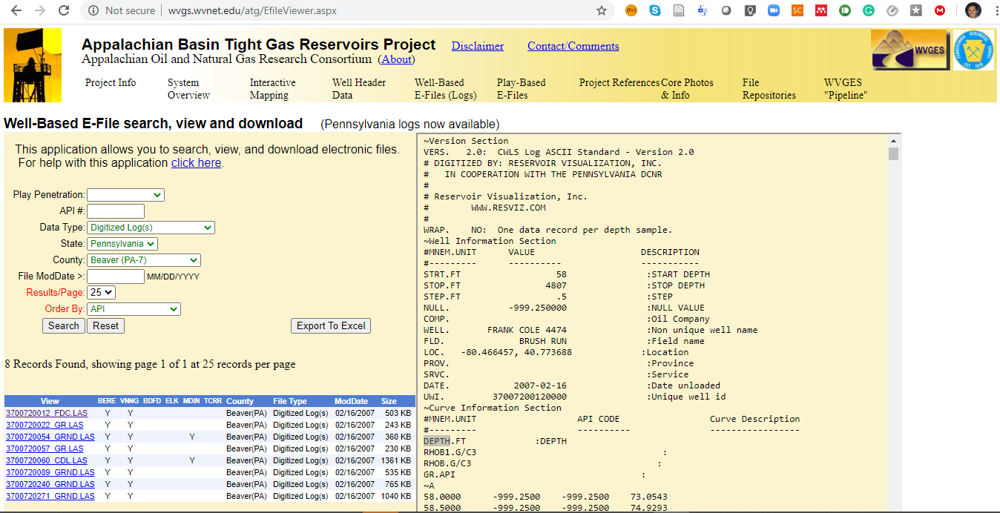

# Datos del curso

Posgrado en Ciencias de la Tierra, **UNAM**

*Tema selecto de modelación*: Machine Learning

*Grupo*: T004

*Entidad*: 72

*Act. Académica*: 63634

**Horario y lugar**

Martes 08:00 - 10:00 am, Unidad de Posgrado Aula F-305

Jueves 08:00 - 10:00 am, Unidad de Posgrado Aula B-307

**Contacto**: mentofran@gmail.com

# Class material

Temario y bibliografía completa en español [aquí](TEMARIO_syllabus.pdf).

This project hosts material for the **machine learning in geosciences** class.

Related sites for software demonstrations are:

* https://github.com/ageron/handson-ml2
* https://github.com/GeostatsGuy?tab=repositories 

## Geo-Datasets

* [Equinor's Volve Oil & Gas dataset](https://www.equinor.com/en/how-and-why/digitalisation-in-our-dna/volve-field-data-village-download.html)
* [West Virginia Geological Survey](http://www.wvgs.wvnet.edu/atg/EfileViewer.aspx)

# Bibliography

* **Mathematics and algorithms**.

  * Gareth James, Daniela Witten, Trevor Hastie and Robert Tibshirani. [An Introduction to Statistical Learning, with Applications in R](http://faculty.marshall.usc.edu/gareth-james/ISL/). 

  * Bishop, Christopher. 2006. Pattern Recognition and Machine Learning. Information Science and Statistics. New York: Springer-Verlag. https://www.springer.com/us/book/9780387310732.
  
  <!-- * Hastie, Trevor, Robert Tibshirani, and J. H. Friedman. 2009. The Elements of Statistical Learning: Data Mining, Inference, and Prediction. Springer Series in Statistics. New York, NY: Springer. https://www.springer.com/gp/book/9780387848570. -->

* **Software tools**. Géron, Aurélien. 2019. Hands-On Machine Learning with Scikit-Learn, Keras and TensorFlow. https://www.oreilly.com/library/view/hands-on-machine-learning/9781492032632/.

<!-- * **Applications**. Guangren. 2014. Data Mining and Knowledge Discovery for Geoscientists. https://www.elsevier.com/books/data-mining-and-knowledge-discovery-for-geoscientists/shi/978-0-12-410437-2. -->
